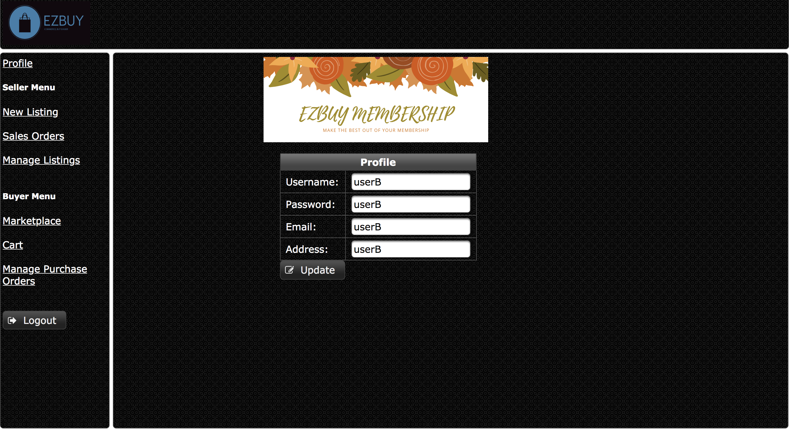

# ezbuy_online_ecommerce
An online ecommerce platform developed with Java EE, JSF Technology &amp; Primefaces

As this platform was developed with Primefaces technology for a school assignment, there was a lack of front-end design as this assignment focuses more on back-end development.

